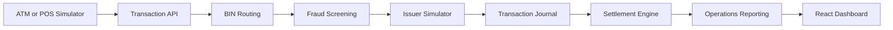
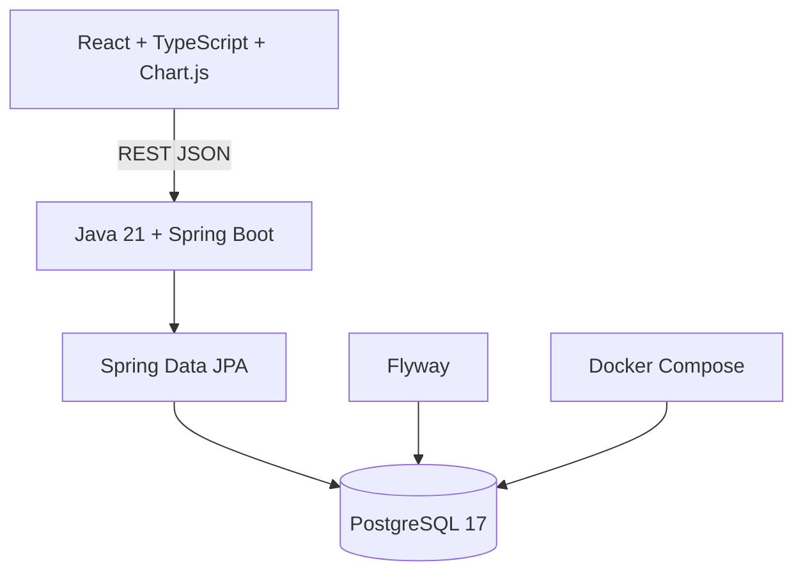

# Enterprise Payment Switching Simulator

EPSS is an original, portfolio-oriented simulator demonstrating high-level payment-switching concepts through a Java and Spring technology stack. It is not Postilion, BASE24-eps, or a replacement for any commercial payment product.

## Demonstrated capabilities

- Transaction acquisition through a REST interface
- Transaction journaling with masked card data
- Database-backed BIN routing using synthetic demonstration ranges
- Simulated issuer authorization decisions
- Fraud controls and fraud-alert evidence
- Settlement batching and issuer-level reconciliation
- Operational metrics and a React management dashboard
- Flyway-controlled database evolution
- Docker-based local PostgreSQL infrastructure

## Two-dimensional capability line



## Technology view



## Releases

- `v1-foundation`: backend, frontend and database foundation
- `v1.1-transaction-journal`: transaction journal and API
- `v1.2-routing-engine`: synthetic BIN routing
- `v1.3-issuer-simulator`: simulated issuer authorization
- `v1.4-fraud-engine`: fraud decisions and audit journal
- `v1.5-settlement-engine`: settlement batching and reconciliation
- `v1.6-operations-dashboard`: operational reporting and dashboard

## Local endpoints

- `POST /api/v1/transactions`
- `POST /api/v1/settlements/batches`
- `GET /api/v1/settlements/batches/{batchId}`
- `GET /api/v1/operations/summary`
- `GET /api/v1/operations/issuers`
- `GET /api/v1/operations/fraud`
- `GET /api/v1/operations/settlements`
- `GET /actuator/health`

## Repository map

```text
enterprise-payment-switching-simulator/
├── switch-api/              Spring Boot processing and reporting API
├── dashboard-ui/            React operations dashboard
├── docker/                  Local infrastructure definition
├── docs/                    Governance and portfolio documentation
├── architecture/            Two-dimensional Mermaid source views
├── issuer-bank-simulator/   Reserved extension boundary
├── fraud-engine/            Reserved extension boundary
└── settlement-engine/       Reserved extension boundary
```

## Security and data handling

- Demonstration card numbers are synthetic.
- Stored card values are masked.
- No live payment credentials, keys, PIN data, CVV data, production BIN tables, scheme keys, or proprietary product configuration should be committed.
- Local secrets must remain outside source control.

## Documentation

- [Architecture overview](docs/ARCHITECTURE.md)
- [Capability catalogue](docs/CAPABILITY_CATALOGUE.md)
- [Metadata catalogue](docs/METADATA_CATALOGUE.md)
- [Demo journey](docs/DEMO_JOURNEY.md)
- [Release roadmap](docs/ROADMAP.md)
- [Publication boundary](PUBLICATION_BOUNDARY.md)

## Disclaimer

This repository is an independent educational and portfolio demonstrator. Product names may be referenced only to describe general industry experience or conceptual context. No proprietary source code, configuration, interfaces, manuals, cryptographic material, or confidential operational information is included.
