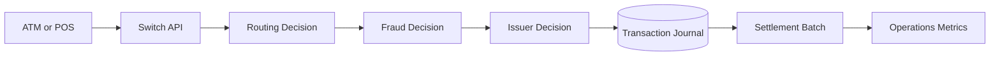
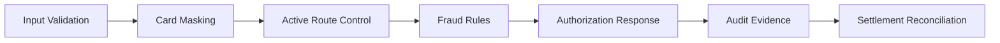
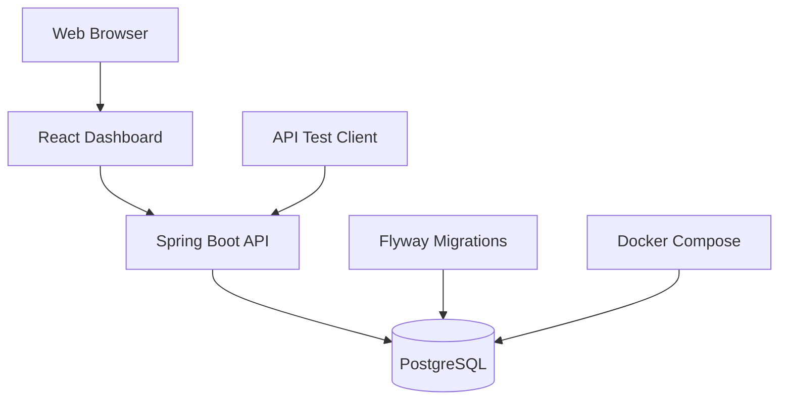

# Architecture Overview

## Context

EPSS demonstrates the controlled journey of a synthetic card transaction from acquisition through routing, risk evaluation, simulated authorization, journaling, settlement and management reporting.

## Processing line

## Control line

## Container view

## Public architecture boundary

The diagrams intentionally communicate responsibilities, interfaces and governance outcomes without exposing internal algorithms, production parameters, proprietary message maps, cryptographic procedures, or commercial switch configuration.
